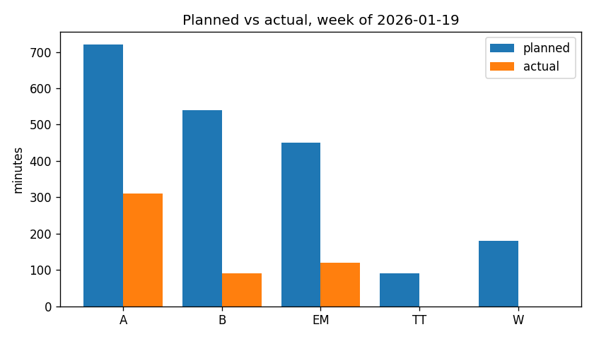

# writing-habit

[](https://github.com/MooersLab/writing-habit-el/actions/workflows/test.yml)
<!-- [](https://melpa.org/#/writing-habit) -->
[](LICENSE)
[](https://www.gnu.org/software/emacs/)

Track and compare planned versus actual academic writing effort, without leaving Emacs.

`writing-habit` is the Emacs Lisp companion to [writing-schedule.el](https://github.com/MooersLab/writing-schedule) and to the Python [writing-habit](https://github.com/MooersLab/writing-habit) package. `writing-schedule` builds a weekly plan; `writing-habit` records what you actually did and shows you the gap. It records self-reported effort, not verified focus, and it is a tool for one person studying and improving their own writing habit, an N-of-1 instrument.

The three stages share one SQLite database defined in `schema.sql`, the single contract between them:

- **plan** turns a weekly plain-text table into planned blocks, reusing the parser inside `writing-schedule.el` so the plan and the schedule never drift into two dialects.
- **track** records the effort you actually spent, from a CSV, an ICS calendar, by hand, or harvested from your own org-clock entries.
- **compare** reports the gap between plan and performance, as an org buffer, an optional plot, or a self-contained HTML dashboard.

Because the schema is the contract, the database this package writes is byte-for-byte the same one the Python package writes, so either tool can read what the other recorded.

## Screenshots

The weekly HTML dashboard, with a light and a dark theme:


The optional planned-versus-actual chart from the compare stage:



## Why an Emacs version

Two reasons. First, most of the intended audience already drafts inside Emacs with org-mode, so a tool that records effort without leaving the editor removes the friction that kills self-tracking. Second, Emacs already measures writing time through org-clock, so the track stage can harvest real clocked minutes instead of asking you to retype them. That org-clock harvest is the one capability the Python version cannot offer.

## Features

- A plan importer that reuses the real `writing-schedule.el` parser, so a weekly table loads into the database exactly as the schedule reads it.
- Four ways to record actual sessions: by hand, from the tracking CSV, from an ICS calendar, and by harvesting completed org-clock entries. The ICS reader uses the bundled `icalendar.el`, so it needs no third-party package.
- A comparison layer over four SQL views: planned versus actual per project with adherence, the activity balance from Rule 2, the barbell split from Rule 6, and the current streak of consecutive writing days.
- A weekly report rendered as an org document, with booktabs tables and captions, so it folds, exports to a clean PDF, and pastes into a log with no conversion.
- An optional planned-versus-actual bar chart, embedded in the report as an Org Babel python block or written directly to a PNG for batch use.
- A self-contained HTML dashboard with two panels: the week's planned schedule as a time-by-day grid colored by activity, and the planned-versus-actual comparison as tiles, per-project meters, the activity balance, and the barbell split. It carries a light and a dark theme and needs no server.
- A schedule-code decoder that reads a compact file name such as `4gAAeAsA-gWW.org` and checks its project letters against a table legend.
- Every stage is an interactive command, gathered under one transient menu, and every stage is also a batch subcommand, so the toolkit runs from a shell or a Makefile the same way the Python command-line interface does.

## Requirements

- GNU Emacs 29.1 or newer, built with SQLite support. The package checks `sqlite-available-p` and reports a clear message when SQLite is missing.
- `transient` 0.4 or newer, which ships with Emacs 28 and later.
- Optional: `writing-schedule.el` on the load path, needed only for `plan import`, and loaded lazily, so every other command runs without it.
- Optional: `python3` with `matplotlib`, needed only for the comparison plot. The HTML dashboard is pure Emacs Lisp and needs no Python.

## Installation

### MELPA

Once the package is accepted on [MELPA](https://melpa.org), install it with the built-in package manager:

```
M-x package-install RET writing-habit RET
```

With `use-package`:

```elisp
(use-package writing-habit
  :ensure t
  :commands (writing-habit writing-habit-initdb))
```

### From the repository

Clone the repository and put it on your load path:

```elisp
(add-to-list 'load-path "/path/to/writing-habit-el")
(require 'writing-habit)
```

Or with `use-package` and a version-controlled checkout on Emacs 30 or newer:

```elisp
(use-package writing-habit
  :vc (:url "https://github.com/MooersLab/writing-habit-el" :rev :newest)
  :commands (writing-habit writing-habit-initdb))
```

To enable `plan import`, also install `writing-schedule.el` and make sure it is on the load path.

## Quick start

Open the menu with `M-x writing-habit` and work down it, or run the commands directly.

1. Create a database. `M-x writing-habit-initdb` prompts for a file name and seeds the schema.
2. Import a weekly plan. `M-x writing-habit-plan-import-file` reads a filled `writing-schedule` table for a week.
3. Record actual sessions. Use `M-x writing-habit-track-add-to-file` for a quick end-of-day entry, `writing-habit-track-import-csv-file` for the tracking CSV, `writing-habit-track-import-ics-file` for a calendar, or `writing-habit-track-harvest-clock-file` to pull in completed org-clock entries.
4. Review the week. `M-x writing-habit-report-week` opens the comparison as an org buffer, and `M-x writing-habit-dashboard` writes the HTML dashboard and opens it in a browser.

## The transient menu

`M-x writing-habit` opens a menu that gathers every command:

```
writing-habit
  Set up
    d  Create a database
  Plan and track
    p  Import a weekly plan
    c  Import actuals CSV
    i  Import actuals ICS
    k  Harvest org clocks
    a  Add a session by hand
  Review
    r  Weekly report
    D  HTML dashboard
    n  Decode a schedule code
```

## Command reference

| Command | What it does |
|---|---|
| `writing-habit` | Open the transient menu |
| `writing-habit-initdb` | Create the schema and seed the activities in a database |
| `writing-habit-plan-import-file` | Load a weekly `writing-schedule` table for a week |
| `writing-habit-track-add-to-file` | Add one session by hand |
| `writing-habit-track-import-csv-file` | Import the tracking CSV |
| `writing-habit-track-import-ics-file` | Import an actuals calendar |
| `writing-habit-track-harvest-clock-file` | Harvest completed org-clock entries |
| `writing-habit-report-week` | Show the weekly comparison as an org buffer |
| `writing-habit-dashboard` | Write and open the HTML dashboard |
| `writing-habit-name` | Decode a schedule code and check it against a legend |

## Batch use from a shell

The package has a batch entry point, so it runs from a shell or a Makefile the way the Python command-line interface does. Plan import additionally needs `writing-schedule.el` on the load path.

```sh
emacs --batch -l writing-habit -f writing-habit-batch initdb --db habit.db
emacs --batch -l writing-habit -f writing-habit-batch \
      plan import my-week.org --week 2026-01-19 --db habit.db
emacs --batch -l writing-habit -f writing-habit-batch \
      track import actuals.csv --format csv --db habit.db
emacs --batch -l writing-habit -f writing-habit-batch \
      track import actuals.ics --format ics --db habit.db
emacs --batch -l writing-habit -f writing-habit-batch \
      track add --day 2026-01-19 --project A --minutes 75 --category generative --db habit.db
emacs --batch -l writing-habit -f writing-habit-batch compare --week 2026-01-19 --db habit.db
emacs --batch -l writing-habit -f writing-habit-batch \
      compare --week 2026-01-19 --plot week.png --db habit.db
emacs --batch -l writing-habit -f writing-habit-batch \
      dashboard --week 2026-01-19 --out week.html --db habit.db
emacs --batch -l writing-habit -f writing-habit-batch name 4gAAeAsA-gWW --table my-week.org
```

## Recording actual sessions

The CSV template has the columns `date, start, end, minutes, project_code, category, note`. Enter either a start and an end time or a minutes value. Excel and Google Sheets both export CSV, so no extra dependency is needed.

For calendar tracking, keep actuals in their own ICS calendar. Put the legend code in the event summary in brackets, for example `[A] DNPH1 docking`, and put the activity in the categories field. Local floating times import as written, with no timezone shift.

For org-clock harvesting, tag the heading with a project code in brackets and an activity, for example:

```org
** [A] DNPH1 docking :generative:
:LOGBOOK:
CLOCK: [2026-01-19 Mon 04:00]--[2026-01-19 Mon 05:30] =>  1:30
:END:
```

The harvest is idempotent, so running it again over the same clocks inserts nothing new.

## Marking safe and speculative projects

To drive the barbell view, add a risk tag to the end of a legend description in the weekly table, in either the org-tag form `:safe:` or the parenthesis form `(safe)`. Recognized tags are `safe`, `speculative`, and `support`.

```org
| A: DNPH1 docking :safe:      |  |  |  |  |  |
| W: 2026words :speculative:   |  |  |  |  |  |
```

Inside a table cell `:safe:` is literal text, because org reads `:tag:` syntax only on headlines, so it does not affect the table or its export. The plan importer strips the tag before storing the description.

## Schedule-code file names

A weekly table can be named by a compact code that encodes the whole week, for example `4gAAeAsA-gWW.org`. Lowercase letters are activities (`g` generative, `e` editing, `s` support), uppercase letters are projects (one letter is one block), and a digit at the start of a group is the count of consecutive days. A hyphen separates day groups, and `o` is an open day. The full specification is in `docs/table-file-naming-rules.org`.

```
M-x writing-habit-name RET 4gAAeAsA-gWW RET
```

With a prefix argument the command also prompts for a table file and checks the code's project letters against that table's legend. This command needs no database and no third-party package.

## Data model and interoperability

Everything the three stages share lives in `schema.sql`: reference tables for the activities and projects, fact tables for planned blocks and actual sessions, generated columns for the block duration and the week's Monday, and four comparison views. The database is portable, so a session written here reads identically through the Python package, and the reverse holds too, because neither port owns the schema. When the schema changes, it changes in `schema.sql`, and both ports pick it up.

Because Emacs runs only the first statement of a multi-statement string through `sqlite-execute`, `writing-habit-db-init` splits the schema into statements before running them. The schema's string literals contain no semicolons, so the split is safe.

## Configuration

| Variable | Default | Meaning |
|---|---|---|
| `writing-habit-db-schema-file` | `schema.sql` beside the package | Path to the shared schema |
| `writing-habit-report-python` | `"python3"` | Interpreter for the optional plot |

Set them through `M-x customize-group RET writing-habit RET` or in your init file.

## Development

The package is split into focused files, all loaded by the `writing-habit.el` aggregator:

| File | Role |
|---|---|
| `writing-habit-db.el` | Connect, initialize, project and category rows |
| `writing-habit-name.el` | Decode a schedule code and check it against a legend |
| `writing-habit-plan.el` | Parse a weekly table through `writing-schedule.el` |
| `writing-habit-track.el` | Manual, CSV, ICS, and org-clock capture |
| `writing-habit-compare.el` | Run the four views and the streak |
| `writing-habit-report.el` | Render the org report and the optional plot |
| `writing-habit-dashboard.el` | Render the HTML dashboard |
| `writing-habit.el` | Interactive commands, transient menu, batch entry point |

The tests use ERT. Run them and a warnings-as-errors byte-compile from the repository root:

```sh
make test
make compile
```

The plan-import tests need `writing-schedule.el`. Point `WRITING_SCHEDULE_DIR` at its checkout to include them; otherwise those tests skip themselves.

```sh
make test WRITING_SCHEDULE_DIR=/path/to/writing-schedule
```

A committed fixture, a database built by the Python port, is read back through this package in one test, so the two ports stay in step.

## Relationship to the other packages

- [writing-schedule.el](https://github.com/MooersLab/writing-schedule) builds the weekly plan and exports it to iCalendar. `writing-habit` reuses its parser for the plan stage.
- The Python [writing-habit](https://github.com/MooersLab/writing-habit) package is the twin of this one. It shares the schema and the schedule-code specification, so the two interoperate on one database file and produce byte-identical dashboards.

## Contributing

Bug reports, feature ideas, and pull requests are welcome. See [CONTRIBUTING.md](CONTRIBUTING.md) for the development setup, the test commands, the coding conventions, and the interoperability contract with the Python package. Continuous integration runs `make compile` and `make test` across several Emacs versions on every pull request.

## Status

Under active development, and not yet on MELPA. The interfaces may still change.

## License

MIT. See [LICENSE](LICENSE).

## Sources of funding

- NIH: R01 CA242845
- NIH: R01 AI088011
- NIH: P30 CA225520 (PI: R. Mannel)
- NIH: P20 GM103640 and P30 GM145423 (PI: A. West)

## Author

Blaine Mooers, Department of Biochemistry and Physiology, University of Oklahoma Health Campus, blaine-mooers@ou.edu.
