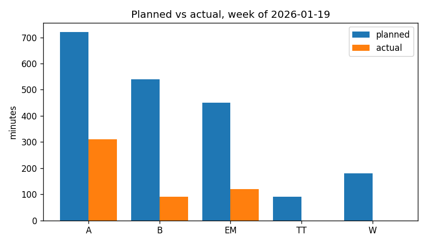
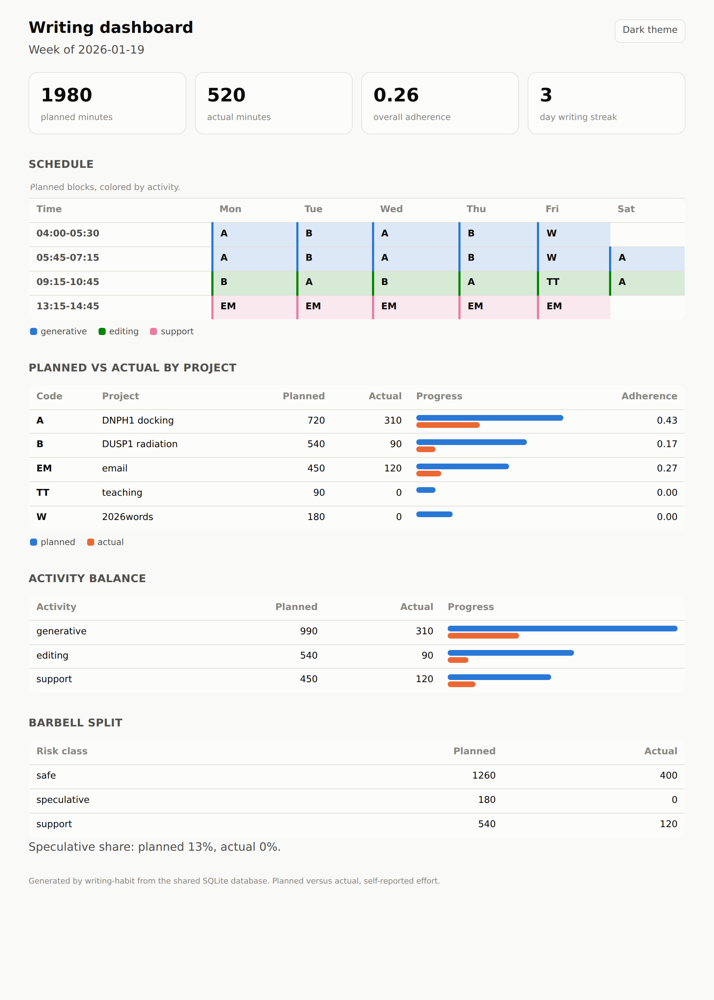
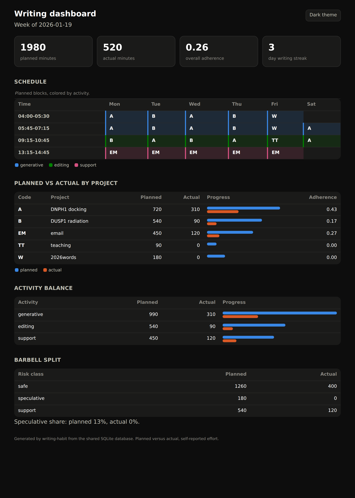

# Dashboard and reports

The compare stage turns the plan-performance gap into numbers a writer can act
on, and it presents them three ways. The org report is the quickest read inside
Emacs, and it drops straight into a log. The optional bar chart is a single
image. The HTML dashboard is the fullest view, and it is the shared rendering
that the Python twin also produces. All three read the same four views, so they
always agree.

## The four measurements

Each output is built from the same four measurements, one per view in the
[data model](data-model.md).

The per-project adherence is the actual minutes over the planned minutes for
each project, which shows where intention and effort diverged. The activity
balance is the split across generative, editing, and support, which shows
whether the week drifted away from generative writing toward easier editing or
support. The barbell split is the split across safe and speculative work, which
shows whether the speculative slot was starved. The streak is the run of days
with any writing at all, which is the visible signal to keep.

## The org report

`M-x writing-habit-report-week` opens the comparison as an org buffer, with
booktabs tables and captions, so it folds, exports to a clean PDF, and pastes
into a log with no conversion. The batch `compare` subcommand prints the same
content to standard output. This is the one output that needs nothing beyond
Emacs itself.

## The optional plot

`M-x writing-habit-report-week` can embed a planned-versus-actual bar chart as
an Org Babel python block, and the batch `compare --plot week.png` writes the
same chart directly to a PNG for batch use. The plot needs `python3` with
`matplotlib`; the org report and the HTML dashboard do not.

## The HTML dashboard

`M-x writing-habit-dashboard` writes a self-contained page and opens it in a
browser. The page embeds its own style and script, so it opens with no server
and no network request. The page has four sections below the summary tiles,
namely the week's schedule redrawn as a time-by-day grid colored by activity,
the planned-versus-actual comparison by project with a two-bar meter and an
adherence column, the activity balance, and the barbell split with the
speculative share.

A button in the top corner switches between a light theme and a dark theme, and
the page also honors the reader's system preference through a
`prefers-color-scheme` media query.

The colors follow a data-viz palette in which the three activities take blue,
green, and magenta, and the planned and actual marks take blue and orange, which
sit far apart for colorblind readers. Every value appears as a direct label in
ink, never by color alone, and the schedule is a labeled table, so the page
reads without relying on color. The dashboard rounds the speculative-share
percent half up, so a share of 12.5 percent reads as 13.

## Byte-identical to the Python twin

The dashboard markup is built deterministically from the shared database, and
the static style and script blocks are the same text both ports carry, so this
package and the Python twin render one identical file from the same data. A
frozen render is committed at `test/fixtures/dashboard.html`, and both test
suites assert against it from the shared `test/fixtures/cross-port.db`, so
neither port can drift into a dialect of its own.
