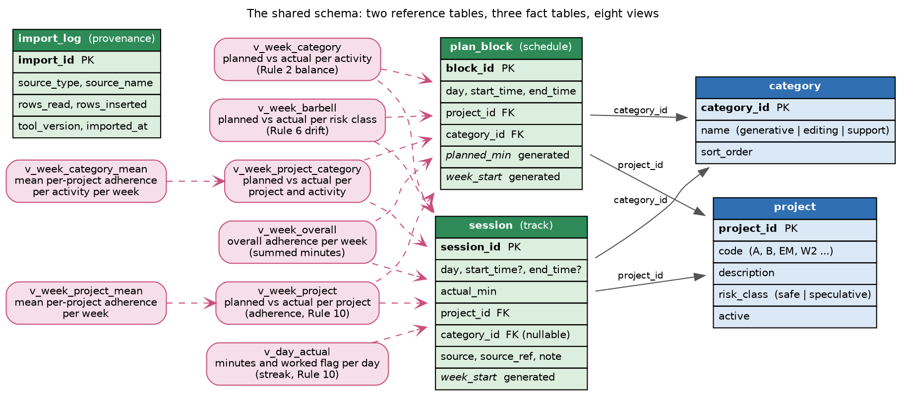

# The shared data model

The database is the single contract between the three stages, so the schema is
the place to look when you want to know exactly what the toolkit stores. The
whole schema is one file, `schema.sql`, and it is applied when you create a
database. Any tool that reads and writes this schema can stand in for a stage,
which is how this Emacs Lisp package and the Python twin share one database
file.

The schema has two reference tables, three fact tables, and four comparison
views. The reference tables hold the things you name once, namely the three
activities and your portfolio of projects. The fact tables hold the events,
namely the planned blocks, the worked sessions, and a log of every import. The
views turn those facts into the four numbers the compare stage reports, so the
compare stage never writes its own aggregation SQL.

## Conventions

Dates are ISO 8601 text in the form `YYYY-MM-DD`. Times are 24-hour `HH:MM`,
zero padded. Durations are integer minutes. The Monday of a week is computed for
you as a generated column named `week_start`, so an importer never calculates
it. Generated columns need SQLite 3.31 or newer.

## The reference tables

The `category` table holds the three writing activities, namely generative,
editing, and support, seeded once when the database is created. A check
constraint limits the name to those three values, because the activity split
depends on a fixed set.

The `project` table is your portfolio, one row per legend code such as `A`,
`B`, or `EM`. Each project carries an optional description and an optional
`risk_class` of safe or speculative, which is what the barbell view groups on.
Support is an activity category, not a risk class, so a support project carries
no `risk_class`. A project row is created by plan import when it first sees a code,
and a tracker can also create one, so a later plan import backfills the
description and the risk class when they were previously empty.

## The fact tables

The `plan_block` table holds the planned blocks written by the plan stage, one
row per block per day. It stores the day, the start and end times, the project,
and the activity. Two columns are generated: `planned_min` is the block length
in minutes, computed from the two times, and `week_start` is the ISO Monday of
the block's day. A unique constraint on the day, the start time, and the project
keeps a re-import from duplicating a block.

The `session` table holds the actual sessions written by the track stage. It
stores the day, the actual minutes, the project, and an optional activity. The
start and end times may be empty, because the paper-then-transcribe path enters
only a duration. A `source` column records where the session came from, one of
`ics`, `csv`, `manual`, or `sqlite`, and a `source_ref` records the row, the
calendar UID, or the org-clock provenance so a re-import can be traced.

The `import_log` table records the provenance of every import, namely what was
read, how many rows were read and inserted, and when. It exists for
reproducibility, because a private study is only as trustworthy as its record of
what went in.

## One rule about the activity of a session

A session may be recorded without an activity, for example a quick duration
entered by hand. Such a session is counted in the project view and the barbell
view because its project is known, and it is left out of the activity view
because its activity is unknown. Give a session an activity whenever the split
across the three activities matters to you.

## The four comparison views

The compare stage reads these four views and nothing else, so the schema stays
the single source of truth for every total.

| View | What it returns | What it feeds |
|------|-----------------|---------------|
| `v_week_project` | planned and actual minutes and an adherence ratio, per week and project | the per-project adherence, the Rule 10 signal |
| `v_week_category` | planned and actual minutes, per week and activity | the Rule 2 balance across the three activities |
| `v_week_barbell` | planned and actual minutes, per week and risk class | the Rule 6 drift, whether the speculative slot was starved |
| `v_day_actual` | actual minutes and a worked flag, per day | the streak of consecutive writing days |

The adherence ratio in `v_week_project` is the actual minutes over the planned
minutes, rounded to two places, and it is null when nothing was planned. The
streak is counted from `v_day_actual` as the run of consecutive worked days
ending at the latest worked day.

## How Emacs applies the schema

Emacs runs only the first statement of a multi-statement string through
`sqlite-execute`, so `writing-habit-db-init` splits `schema.sql` into
statements before running them. The schema's string literals contain no
semicolons, so the split is safe. This is an implementation detail of the Emacs
port; the schema file itself is identical to the one the Python port applies.
