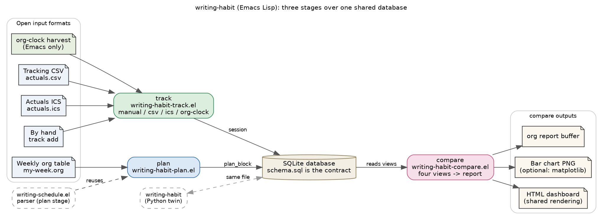

# writing-habit (Emacs Lisp)

`writing-habit` records the writing effort you actually spend and compares it
against the week you planned, without leaving Emacs. It is the Emacs Lisp
companion to
[writing-schedule.el](https://github.com/MooersLab/writing-schedule) and the
twin of the Python package
[writing-habit](https://github.com/MooersLab/writing-habit-py). It is an N-of-1
instrument for one person studying and improving a private writing habit, so it
records self-reported effort rather than verified focus.

The toolkit has three stages that share one SQLite database. The **plan** stage
turns a weekly plain-text table into planned blocks, and it reuses the parser
inside `writing-schedule.el` so the plan and the schedule never drift into two
dialects. The **track** stage records the sessions you actually worked, from a
CSV, from an ICS calendar, by hand, or harvested from your own org-clock
entries. The **compare** stage reports the gap between plan and performance as
an org buffer, an optional plot, or a self-contained HTML dashboard.



The database schema in `schema.sql` is the single contract between the stages.
Because the schema is the contract, the database this package writes is
byte-for-byte the same one the Python package writes, so either tool reads what
the other recorded, and the two render one byte-identical dashboard from the
same data. The org-clock harvest is the one capture path this package offers
that the Python version cannot, because Emacs already measures writing time.

```{toctree}
:maxdepth: 2
:caption: User guide

installation
tutorial
data-model
tracking-formats
schedule-codes
commands
dashboard
```

```{toctree}
:maxdepth: 2
:caption: Reference

function-reference
development
```

## A one-minute example

Open the menu with `M-x writing-habit` and work down it, or drive the stages
from a shell with the batch entry point:

```sh
emacs --batch -l writing-habit -f writing-habit-batch initdb --db habit.db
emacs --batch -l writing-habit -f writing-habit-batch \
      plan import my-week.org --week 2026-01-19 --db habit.db
emacs --batch -l writing-habit -f writing-habit-batch \
      track import actuals.csv --format csv --db habit.db
emacs --batch -l writing-habit -f writing-habit-batch compare --week 2026-01-19 --db habit.db
emacs --batch -l writing-habit -f writing-habit-batch \
      dashboard --week 2026-01-19 --out week.html --db habit.db
```

The batch subcommands mirror the Python command-line interface, so a Makefile
that drives one port drives the other with only the launcher changed.
