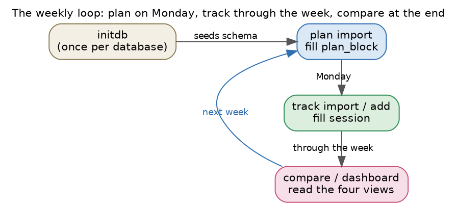

# Tutorial: one writing week from plan to dashboard

This walkthrough runs the whole loop on a single week, from inside Emacs. You
seed a database once, import a plan, record what you actually did, and read the
gap back as an org report and as a dashboard. Every step is an interactive
command gathered under `M-x writing-habit`, and every step is also a batch
subcommand for a shell or a Makefile.



## Step 1, seed the database

The database is one SQLite file. Create it once with `M-x writing-habit-initdb`,
which prompts for a file name and seeds the three writing activities. From a
shell:

```sh
emacs --batch -l writing-habit -f writing-habit-batch initdb --db habit.db
```

You can keep more than one database, because every command takes a database
file. A second database is useful when you want to study a separate project or
a separate span of time in isolation.

## Step 2, import the plan

The plan is a weekly `writing-schedule` table. Run
`M-x writing-habit-plan-import-file`, which prompts for the database, the table,
and any day inside the target week, because the week snaps to the Monday on or
before that date. From a shell:

```sh
emacs --batch -l writing-habit -f writing-habit-batch \
      plan import my-week.org --week 2026-01-19 --db habit.db
```

The importer calls the real `writing-schedule.el` parser, so every planned
block lands in the `plan_block` table with its project, its activity, and its
minutes. This step needs `writing-schedule.el` on the load path; the other
steps do not.

## Step 3, track what you actually did

Record real sessions in any of four ways, each an interactive command and a
batch path. Use `M-x writing-habit-track-add-to-file` for a quick end-of-day
entry, `M-x writing-habit-track-import-csv-file` for the tracking CSV,
`M-x writing-habit-track-import-ics-file` for a calendar, or
`M-x writing-habit-track-harvest-clock-file` to pull in completed org-clock
entries. From a shell:

```sh
emacs --batch -l writing-habit -f writing-habit-batch \
      track import actuals.csv --format csv --db habit.db
emacs --batch -l writing-habit -f writing-habit-batch \
      track add --day 2026-01-19 --project A --minutes 75 --category generative --db habit.db
```

The four formats and their conventions are covered in full under
[Tracking formats](tracking-formats.md). The org-clock harvest is the capture
path unique to the Emacs version.

## Step 4, read the gap as an org report

`M-x writing-habit-report-week` opens the comparison as an org buffer. It totals
the week, breaks it down by project, by activity, and by the safe-versus-
speculative barbell split, and it closes with the current streak of consecutive
writing days. The buffer is org, so it folds, exports to a clean PDF, and pastes
into a log with no conversion. From a shell, `compare` prints the same content:

```sh
emacs --batch -l writing-habit -f writing-habit-batch compare --week 2026-01-19 --db habit.db
```

## Step 5, read the gap as a dashboard

`M-x writing-habit-dashboard` writes a self-contained HTML page and opens it in
a browser. The page embeds its own style and script, so it needs no server and
no network. It carries a light theme and a dark theme, and a button in the top
corner switches between them. From a shell:

```sh
emacs --batch -l writing-habit -f writing-habit-batch \
      dashboard --week 2026-01-19 --out week.html --db habit.db
```


## What each output is for

The org report is the quickest read inside Emacs, and it drops straight into a
log. The optional bar chart from `compare --plot week.png` is a single image you
can embed. The dashboard is the fullest view, and it is the shared rendering
that the Python twin also produces, byte for byte, from the same database. The
three read one source, so a change to the plan or the sessions changes all three
the next time you run the commands. The [Dashboard and reports](dashboard.md)
page explains each panel in detail.
